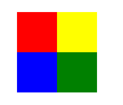
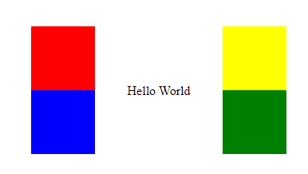
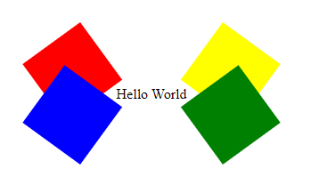

# Exercise 2.1

## In this exercise I create a design of Google Docs using HTML, Css, display properties like flex, transition, transform, and also use hover effect and css for designing.

 

### This the view of the web page

### Author 
- [@nitishJha]